```mermaid
erDiagram
 __EFMigrationsHistory {
 string MigrationId
 string ProductVersion
 }

 AbpUsers {
 bigint Id
 string UserName
 string Name
 string Surname
 string EmailAddress
 string Password
 bool IsActive
 bool IsDeleted
 int TenantId
 bigint CreatorUserId
 bigint LastModifierUserId
 bigint DeleterUserId
 datetime CreationTime
 datetime LastModificationTime
 datetime DeletionTime
 }

 AbpRoles {
 int Id
 string Name
 string DisplayName
 string NormalizedName
 string Description
 bool IsStatic
 bool IsDefault
 bool IsDeleted
 int TenantId
 bigint CreatorUserId
 bigint LastModifierUserId
 bigint DeleterUserId
 datetime CreationTime
 datetime LastModificationTime
 datetime DeletionTime
 }

 AbpPermissions {
 bigint Id
 string Name
 bool IsGranted
 string Discriminator
 int RoleId
 bigint UserId
 int TenantId
 bigint CreatorUserId
 datetime CreationTime
 }

 AbpUserRoles {
 bigint Id
 bigint UserId
 int RoleId
 int TenantId
 bigint CreatorUserId
 datetime CreationTime
 }

 AbpUserClaims {
 bigint Id
 bigint UserId
 string ClaimType
 string ClaimValue
 int TenantId
 bigint CreatorUserId
 datetime CreationTime
 }

 AbpRoleClaims {
 bigint Id
 int RoleId
 string ClaimType
 string ClaimValue
 int TenantId
 bigint CreatorUserId
 datetime CreationTime
 }

 AbpUserLogins {
 bigint Id
 bigint UserId
 string LoginProvider
 string ProviderKey
 int TenantId
 }

 AbpUserTokens {
 bigint Id
 bigint UserId
 string LoginProvider
 string Name
 string Value
 datetime ExpireDate
 int TenantId
 }

 AbpUserAccounts {
 bigint Id
 bigint UserId
 bigint UserLinkId
 string UserName
 string EmailAddress
 int TenantId
 bool IsDeleted
 bigint CreatorUserId
 bigint LastModifierUserId
 bigint DeleterUserId
 datetime CreationTime
 datetime LastModificationTime
 datetime DeletionTime
 }

 AbpUserLoginAttempts {
 bigint Id
 bigint UserId
 string UserNameOrEmailAddress
 string TenancyName
 int Result
 string ClientIpAddress
 string BrowserInfo
 datetime CreationTime
 int TenantId
 }

 AbpOrganizationUnits {
 bigint Id
 string Code
 string DisplayName
 bigint ParentId
 int TenantId
 bool IsDeleted
 bigint CreatorUserId
 bigint LastModifierUserId
 bigint DeleterUserId
 datetime CreationTime
 datetime LastModificationTime
 datetime DeletionTime
 }

 AbpOrganizationUnitRoles {
 bigint Id
 bigint OrganizationUnitId
 int RoleId
 int TenantId
 bool IsDeleted
 bigint CreatorUserId
 datetime CreationTime
 }

 AbpUserOrganizationUnits {
 bigint Id
 bigint OrganizationUnitId
 bigint UserId
 int TenantId
 bool IsDeleted
 bigint CreatorUserId
 datetime CreationTime
 }

 AbpEditions {
 int Id
 string Name
 string DisplayName
 bool IsDeleted
 bigint CreatorUserId
 bigint LastModifierUserId
 bigint DeleterUserId
 datetime CreationTime
 datetime LastModificationTime
 datetime DeletionTime
 }

 AbpFeatures {
 bigint Id
 string Name
 string Value
 string Discriminator
 int EditionId
 int TenantId
 bigint CreatorUserId
 datetime CreationTime
 }

 AbpTenants {
 int Id
 string TenancyName
 string Name
 string ConnectionString
 int EditionId
 bool IsActive
 bool IsDeleted
 bigint CreatorUserId
 bigint LastModifierUserId
 bigint DeleterUserId
 datetime CreationTime
 datetime LastModificationTime
 datetime DeletionTime
 }

 AbpSettings {
 bigint Id
 string Name
 string Value
 int TenantId
 bigint UserId
 bigint CreatorUserId
 bigint LastModifierUserId
 datetime CreationTime
 datetime LastModificationTime
 }

 AbpLanguages {
 int Id
 string Name
 string DisplayName
 string Icon
 bool IsDisabled
 bool IsDeleted
 int TenantId
 bigint CreatorUserId
 bigint LastModifierUserId
 bigint DeleterUserId
 datetime CreationTime
 datetime LastModificationTime
 datetime DeletionTime
 }

 AbpLanguageTexts {
 bigint Id
 string Source
 string LanguageName
 string Key
 string Value
 int TenantId
 bigint CreatorUserId
 bigint LastModifierUserId
 datetime CreationTime
 datetime LastModificationTime
 }

 AbpAuditLogs {
 bigint Id
 string ServiceName
 string MethodName
 string Parameters
 string ReturnValue
 string Exception
 string ExceptionMessage
 int ExecutionDuration
 datetime ExecutionTime
 bigint UserId
 int TenantId
 bigint ImpersonatorUserId
 int ImpersonatorTenantId
 string ClientIpAddress
 string ClientName
 string BrowserInfo
 string CustomData
 }

 AbpEntityChangeSets {
 bigint Id
 datetime CreationTime
 bigint UserId
 int TenantId
 bigint ImpersonatorUserId
 int ImpersonatorTenantId
 string ClientIpAddress
 string ClientName
 string BrowserInfo
 string Reason
 string ExtensionData
 }

 AbpEntityChanges {
 bigint Id
 bigint EntityChangeSetId
 string EntityTypeFullName
 string EntityId
 int ChangeType
 datetime ChangeTime
 int TenantId
 }

 AbpEntityPropertyChanges {
 bigint Id
 bigint EntityChangeId
 string PropertyName
 string PropertyTypeFullName
 string OriginalValue
 string NewValue
 string OriginalValueHash
 string NewValueHash
 int TenantId
 }

 AbpDynamicProperties {
 int Id
 string PropertyName
 string InputType
 string Permission
 string DisplayName
 int TenantId
 }

 AbpDynamicEntityProperties {
 int Id
 int DynamicPropertyId
 string EntityFullName
 int TenantId
 }

 AbpDynamicPropertyValues {
 bigint Id
 int DynamicPropertyId
 string Value
 int TenantId
 }

 AbpDynamicEntityPropertyValues {
 bigint Id
 int DynamicEntityPropertyId
 string EntityId
 string Value
 int TenantId
 }

 AbpNotifications {
 guid Id
 string NotificationName
 string Data
 string DataTypeName
 string EntityTypeName
 string EntityTypeAssemblyQualifiedName
 string EntityId
 string UserIds
 string ExcludedUserIds
 string TenantIds
 string TargetNotifiers
 int Severity
 bigint CreatorUserId
 datetime CreationTime
 }

 AbpNotificationSubscriptions {
 guid Id
 string NotificationName
 bigint UserId
 int TenantId
 string EntityTypeName
 string EntityTypeAssemblyQualifiedName
 string EntityId
 bigint CreatorUserId
 datetime CreationTime
 }

 AbpTenantNotifications {
 guid Id
 string NotificationName
 string Data
 string DataTypeName
 string EntityTypeName
 string EntityTypeAssemblyQualifiedName
 string EntityId
 int Severity
 int TenantId
 bigint CreatorUserId
 datetime CreationTime
 }

 AbpUserNotifications {
 guid Id
 guid TenantNotificationId
 bigint UserId
 int TenantId
 int State
 string TargetNotifiers
 datetime CreationTime
 }

 AbpBackgroundJobs {
 bigint Id
 string JobType
 string JobArgs
 int TryCount
 int Priority
 bool IsAbandoned
 datetime CreationTime
 datetime NextTryTime
 datetime LastTryTime
 bigint CreatorUserId
 }

 AbpWebhookEvents {
 guid Id
 string WebhookName
 string Data
 int TenantId
 bool IsDeleted
 datetime CreationTime
 datetime DeletionTime
 }

 AbpWebhookSendAttempts {
 guid Id
 guid WebhookEventId
 guid WebhookSubscriptionId
 string Response
 int ResponseStatusCode
 int TenantId
 datetime CreationTime
 datetime LastModificationTime
 }

 AbpWebhookSubscriptions {
 guid Id
 string WebhookUri
 string Secret
 string Webhooks
 string Headers
 bool IsActive
 int TenantId
 bigint CreatorUserId
 datetime CreationTime
 }

 AbpPermissions }o--|| AbpRoles : "RoleId -> Id"
 AbpPermissions }o--|| AbpUsers : "UserId -> Id"

 AbpRoleClaims }o--|| AbpRoles : "RoleId -> Id"

 AbpUserClaims }o--|| AbpUsers : "UserId -> Id"
 AbpUserLogins }o--|| AbpUsers : "UserId -> Id"
 AbpUserRoles }o--|| AbpUsers : "UserId -> Id"
 AbpUserTokens }o--|| AbpUsers : "UserId -> Id"

 AbpOrganizationUnits }o--|| AbpOrganizationUnits : "ParentId -> Id"

 AbpFeatures }o--|| AbpEditions : "EditionId -> Id"
 AbpTenants }o--|| AbpEditions : "EditionId -> Id"

 AbpEntityChanges }o--|| AbpEntityChangeSets : "EntityChangeSetId -> Id"
 AbpEntityPropertyChanges }o--|| AbpEntityChanges : "EntityChangeId -> Id"

 AbpDynamicEntityProperties }o--|| AbpDynamicProperties : "DynamicPropertyId -> Id"
 AbpDynamicPropertyValues }o--|| AbpDynamicProperties : "DynamicPropertyId -> Id"
 AbpDynamicEntityPropertyValues }o--|| AbpDynamicEntityProperties : "DynamicEntityPropertyId -> Id"

 AbpWebhookSendAttempts }o--|| AbpWebhookEvents : "WebhookEventId -> Id"
```

# IFare_BDAPIDb 資料表說明

## 1. 整體結構概觀

`IFare_BDAPIDb` 這個資料庫，從目前 schema 來看，主要不是內容資料庫，而是 **ABP 後台系統資料庫**。
它的用途比較偏向：

1. **後台使用者 / 角色 / 權限**
   - `AbpUsers`
   - `AbpRoles`
   - `AbpPermissions`
   - `AbpUserRoles`
   - `AbpUserClaims`
   - `AbpRoleClaims`
   - `AbpUserLogins`
   - `AbpUserTokens`
   - `AbpUserAccounts`
   - `AbpUserLoginAttempts`

2. **組織架構**
   - `AbpOrganizationUnits`
   - `AbpOrganizationUnitRoles`
   - `AbpUserOrganizationUnits`

3. **多租戶 / Edition / Feature**
   - `AbpTenants`
   - `AbpEditions`
   - `AbpFeatures`

4. **系統設定 / 多語系**
   - `AbpSettings`
   - `AbpLanguages`
   - `AbpLanguageTexts`

5. **審計 / 實體變更追蹤**
   - `AbpAuditLogs`
   - `AbpEntityChangeSets`
   - `AbpEntityChanges`
   - `AbpEntityPropertyChanges`

6. **動態欄位**
   - `AbpDynamicProperties`
   - `AbpDynamicEntityProperties`
   - `AbpDynamicPropertyValues`
   - `AbpDynamicEntityPropertyValues`

7. **通知 / 背景工作 / Webhook**
   - `AbpNotifications`
   - `AbpNotificationSubscriptions`
   - `AbpTenantNotifications`
   - `AbpUserNotifications`
   - `AbpBackgroundJobs`
   - `AbpWebhookEvents`
   - `AbpWebhookSendAttempts`
   - `AbpWebhookSubscriptions`

8. **Migration / 版本資訊**
   - `__EFMigrationsHistory`

---

# 2. 資料表逐一說明

---

## `__EFMigrationsHistory`
### 用途
Entity Framework Core migration 紀錄表。

### 主要欄位
- `MigrationId`: migration 名稱
- `ProductVersion`: EF Core 版本

### 備註
這張通常只拿來追蹤 schema 版本，不是業務資料。

---

## `AbpUsers`
### 用途
後台使用者主表。

### 主要欄位
- `Id`: 使用者主鍵
- `UserName`: 登入帳號
- `Name`: 名
- `Surname`: 姓
- `EmailAddress`: Email
- `Password`: 密碼雜湊或密碼欄位
- `IsActive`: 是否啟用
- `IsDeleted`: 是否刪除
- `TenantId`: 所屬租戶

### 被哪些表依賴
- `AbpPermissions.UserId`
- `AbpUserClaims.UserId`
- `AbpUserLogins.UserId`
- `AbpUserRoles.UserId`
- `AbpUserTokens.UserId`

### 系統用途
ABP 後台登入、權限指派、通知、審計等，幾乎都以這張為中心。

---

## `AbpRoles`
### 用途
角色主表。

### 主要欄位
- `Id`
- `Name`
- `DisplayName`
- `NormalizedName`
- `Description`
- `IsStatic`
- `IsDefault`
- `TenantId`

### 被哪些表依賴
- `AbpPermissions.RoleId`
- `AbpRoleClaims.RoleId`

### 系統用途
定義後台角色，例如管理員、編輯者等。

---

## `AbpPermissions`
### 用途
權限授權表。

### 主要欄位
- `Id`
- `Name`: 權限名稱
- `IsGranted`: 是否授權
- `Discriminator`: 權限類型
- `RoleId`
- `UserId`
- `TenantId`

### 功能
這張表可以把權限直接掛在：
- 某個角色
- 某個使用者

---

## `AbpUserRoles`
### 用途
使用者與角色的關聯表。

### 主要欄位
- `Id`
- `UserId`
- `RoleId`
- `TenantId`

### 功能
表示某位使用者屬於哪些角色。

---

## `AbpUserClaims`
### 用途
使用者 claim 資訊表。

### 主要欄位
- `Id`
- `UserId`
- `ClaimType`
- `ClaimValue`

### 功能
補充使用者身份或授權資訊。

---

## `AbpRoleClaims`
### 用途
角色 claim 資訊表。

### 主要欄位
- `Id`
- `RoleId`
- `ClaimType`
- `ClaimValue`

### 功能
補充角色層級的身份或授權資訊。

---

## `AbpUserLogins`
### 用途
外部登入資訊表。

### 主要欄位
- `Id`
- `UserId`
- `LoginProvider`
- `ProviderKey`

### 功能
記錄外部登入來源，例如第三方登入 provider。

---

## `AbpUserTokens`
### 用途
使用者 token 表。

### 主要欄位
- `Id`
- `UserId`
- `LoginProvider`
- `Name`
- `Value`
- `ExpireDate`

### 功能
保存 token 或登入驗證相關資料。

---

## `AbpUserAccounts`
### 用途
使用者帳號對應表。

### 主要欄位
- `Id`
- `UserId`
- `UserLinkId`
- `UserName`
- `EmailAddress`
- `TenantId`

### 功能
處理使用者帳號映射、帳號連結等資訊。

---

## `AbpUserLoginAttempts`
### 用途
登入嘗試紀錄表。

### 主要欄位
- `Id`
- `UserId`
- `UserNameOrEmailAddress`
- `TenancyName`
- `Result`
- `ClientIpAddress`
- `BrowserInfo`
- `CreationTime`

### 功能
追蹤登入成功或失敗紀錄，可用於安全稽核。

---

## `AbpOrganizationUnits`
### 用途
組織單位主表。

### 主要欄位
- `Id`
- `Code`
- `DisplayName`
- `ParentId`
- `TenantId`

### 功能
建立後台的部門 / 組織樹狀結構。

### 關聯
- `ParentId -> Id`，表示自我參照的樹狀結構。

---

## `AbpOrganizationUnitRoles`
### 用途
組織單位與角色關聯表。

### 主要欄位
- `Id`
- `OrganizationUnitId`
- `RoleId`
- `TenantId`

### 功能
表示某個組織單位掛了哪些角色。

---

## `AbpUserOrganizationUnits`
### 用途
使用者與組織單位關聯表。

### 主要欄位
- `Id`
- `OrganizationUnitId`
- `UserId`
- `TenantId`

### 功能
表示某位使用者隸屬哪些組織單位。

---

## `AbpEditions`
### 用途
Edition 主表。

### 主要欄位
- `Id`
- `Name`
- `DisplayName`

### 功能
ABP 多租戶機制中，用來區分不同版本 / 套餐。

---

## `AbpFeatures`
### 用途
功能設定表。

### 主要欄位
- `Id`
- `Name`
- `Value`
- `Discriminator`
- `EditionId`
- `TenantId`

### 功能
定義某個 edition 或 tenant 可用的功能開關。

---

## `AbpTenants`
### 用途
租戶主表。

### 主要欄位
- `Id`
- `TenancyName`
- `Name`
- `ConnectionString`
- `EditionId`
- `IsActive`

### 功能
ABP 多租戶架構的核心表。

---

## `AbpSettings`
### 用途
系統設定表。

### 主要欄位
- `Id`
- `Name`
- `Value`
- `TenantId`
- `UserId`

### 功能
存放系統層級、租戶層級或使用者層級設定值。

---

## `AbpLanguages`
### 用途
語言主表。

### 主要欄位
- `Id`
- `Name`
- `DisplayName`
- `Icon`
- `IsDisabled`
- `TenantId`

### 功能
定義系統支援哪些語系。

---

## `AbpLanguageTexts`
### 用途
語系文字表。

### 主要欄位
- `Id`
- `Source`
- `LanguageName`
- `Key`
- `Value`

### 功能
保存多語系翻譯內容。

---

## `AbpAuditLogs`
### 用途
API / 應用服務操作稽核表。

### 主要欄位
- `Id`
- `ServiceName`
- `MethodName`
- `Parameters`
- `ReturnValue`
- `Exception`
- `ExecutionDuration`
- `ExecutionTime`
- `UserId`
- `ClientIpAddress`

### 功能
記錄誰在什麼時間呼叫了什麼服務、參數是什麼、是否拋錯。

---

## `AbpEntityChangeSets`
### 用途
一次實體變更事件的總表。

### 主要欄位
- `Id`
- `CreationTime`
- `UserId`
- `TenantId`
- `Reason`
- `ClientIpAddress`

### 功能
代表一次操作中所有資料變更的集合。

---

## `AbpEntityChanges`
### 用途
實體層級變更表。

### 主要欄位
- `Id`
- `EntityChangeSetId`
- `EntityTypeFullName`
- `EntityId`
- `ChangeType`
- `ChangeTime`

### 功能
記錄哪個 entity 被新增 / 修改 / 刪除。

---

## `AbpEntityPropertyChanges`
### 用途
欄位層級變更表。

### 主要欄位
- `Id`
- `EntityChangeId`
- `PropertyName`
- `OriginalValue`
- `NewValue`

### 功能
記錄某次 entity 變更中，哪些欄位從什麼值變成什麼值。

---

## `AbpDynamicProperties`
### 用途
動態欄位主表。

### 主要欄位
- `Id`
- `PropertyName`
- `InputType`
- `Permission`
- `DisplayName`

### 功能
定義可以動態附加的欄位。

---

## `AbpDynamicEntityProperties`
### 用途
動態欄位與 Entity 類型的對應表。

### 主要欄位
- `Id`
- `DynamicPropertyId`
- `EntityFullName`

### 功能
表示某個 dynamic property 掛到哪種 entity 上。

---

## `AbpDynamicPropertyValues`
### 用途
動態欄位可選值表。

### 主要欄位
- `Id`
- `DynamicPropertyId`
- `Value`

### 功能
保存某些動態欄位的候選值。

---

## `AbpDynamicEntityPropertyValues`
### 用途
Entity 實際動態欄位值表。

### 主要欄位
- `Id`
- `DynamicEntityPropertyId`
- `EntityId`
- `Value`

### 功能
記錄某個 entity 實際被賦予的 dynamic value。

---

## `AbpNotifications`
### 用途
通知主表。

### 主要欄位
- `Id`
- `NotificationName`
- `Data`
- `EntityTypeName`
- `EntityId`
- `UserIds`
- `TenantIds`
- `Severity`

### 功能
描述一則通知事件本身。

---

## `AbpNotificationSubscriptions`
### 用途
通知訂閱表。

### 主要欄位
- `Id`
- `NotificationName`
- `UserId`
- `TenantId`

### 功能
表示哪些使用者訂閱了哪些通知。

---

## `AbpTenantNotifications`
### 用途
租戶通知表。

### 主要欄位
- `Id`
- `NotificationName`
- `Data`
- `TenantId`
- `Severity`

### 功能
將通知事件落到某個 tenant 範圍。

---

## `AbpUserNotifications`
### 用途
使用者通知表。

### 主要欄位
- `Id`
- `TenantNotificationId`
- `UserId`
- `State`
- `TargetNotifiers`

### 功能
表示某位使用者收到的通知與閱讀狀態。

---

## `AbpBackgroundJobs`
### 用途
背景工作表。

### 主要欄位
- `Id`
- `JobType`
- `JobArgs`
- `TryCount`
- `Priority`
- `IsAbandoned`
- `NextTryTime`

### 功能
保存背景任務的排程與重試資訊。

---

## `AbpWebhookEvents`
### 用途
Webhook 事件主表。

### 主要欄位
- `Id`
- `WebhookName`
- `Data`
- `TenantId`
- `CreationTime`

### 功能
記錄準備發送的 webhook 事件。

---

## `AbpWebhookSendAttempts`
### 用途
Webhook 發送嘗試紀錄表。

### 主要欄位
- `Id`
- `WebhookEventId`
- `WebhookSubscriptionId`
- `Response`
- `ResponseStatusCode`
- `CreationTime`

### 功能
記錄 webhook 發送結果與回應內容。

---

## `AbpWebhookSubscriptions`
### 用途
Webhook 訂閱表。

### 主要欄位
- `Id`
- `WebhookUri`
- `Secret`
- `Webhooks`
- `Headers`
- `IsActive`

### 功能
定義 webhook 要送去哪裡，以及使用哪些 headers / secret。

---

# 3. 模組與後台用途對照

## 後台帳號與權限
### 主要資料表
- `AbpUsers`
- `AbpRoles`
- `AbpPermissions`
- `AbpUserRoles`
- `AbpUserClaims`
- `AbpRoleClaims`

### 系統用途
- 使用者登入
- 角色控管
- 權限授權
- claim-based 授權補充

---

## 組織與部門
### 主要資料表
- `AbpOrganizationUnits`
- `AbpOrganizationUnitRoles`
- `AbpUserOrganizationUnits`

### 系統用途
- 組織樹
- 部門角色配置
- 使用者歸屬單位

---

## 多租戶與功能開關
### 主要資料表
- `AbpTenants`
- `AbpEditions`
- `AbpFeatures`

### 系統用途
- tenant 管理
- edition 定義
- feature toggle

---

## 系統設定與語系
### 主要資料表
- `AbpSettings`
- `AbpLanguages`
- `AbpLanguageTexts`

### 系統用途
- 設定值管理
- 多語系設定
- 翻譯內容管理

---

## 稽核與操作追蹤
### 主要資料表
- `AbpAuditLogs`
- `AbpEntityChangeSets`
- `AbpEntityChanges`
- `AbpEntityPropertyChanges`

### 系統用途
- API 呼叫紀錄
- 資料異動追蹤
- 欄位層級變更比對

---

## 動態欄位系統
### 主要資料表
- `AbpDynamicProperties`
- `AbpDynamicEntityProperties`
- `AbpDynamicPropertyValues`
- `AbpDynamicEntityPropertyValues`

### 系統用途
- 動態欄位定義
- 動態欄位掛載到實體
- 動態欄位值保存

---

## 通知 / 背景工作 / Webhook
### 主要資料表
- `AbpNotifications`
- `AbpNotificationSubscriptions`
- `AbpTenantNotifications`
- `AbpUserNotifications`
- `AbpBackgroundJobs`
- `AbpWebhookEvents`
- `AbpWebhookSendAttempts`
- `AbpWebhookSubscriptions`

### 系統用途
- 系統通知
- 使用者通知
- 背景任務
- 對外 webhook 整合

---

# 4. 最重要的理解重點

## `IFare_BDAPIDb` 不是內容主庫
它不像 `IFare` 那樣放：
- 政策
- 消息
- 文章

它主要放的是：

- 後台帳號
- 角色
- 權限
- 稽核
- 設定
- 通知
- 框架級資料

---

## `IFare` 與 `IFare_BDAPIDb` 的分工
- `IFare` → 實際網站內容資料
- `IFare_BDAPIDb` → 後台系統 / ABP 框架資料
