```mermaid
erDiagram
    SysUser {
        bigint ID
        datetime CreateTime
        datetime UpdateTime
        string Account
        string Password
        string UserName
        string Email
        string Permissions
        string State
        bigint CreateUser_ID
        bigint UpdateUser_ID
    }

    CodePolicy {
        bigint ID
        datetime CreateTime
        datetime UpdateTime
        string LabelName
        string State
        bigint CreateUser_ID
        bigint UpdateUser_ID
    }

    CodeDomicile {
        bigint ID
        datetime CreateTime
        datetime UpdateTime
        string LabelName
        string State
        bigint CreateUser_ID
        bigint UpdateUser_ID
    }

    CodeIdentity {
        bigint ID
        datetime CreateTime
        datetime UpdateTime
        string LabelName
        string State
        bigint CreateUser_ID
        bigint UpdateUser_ID
    }

    CodeIncome {
        bigint ID
        datetime CreateTime
        datetime UpdateTime
        string LabelName
        string State
        bigint CreateUser_ID
        bigint UpdateUser_ID
    }

    CodeRecipient {
        bigint ID
        datetime CreateTime
        datetime UpdateTime
        string LabelName
        string State
        bigint CreateUser_ID
        bigint UpdateUser_ID
    }

    CodeKeyword {
        bigint ID
        datetime CreateTime
        datetime UpdateTime
        string LabelName
        string State
        bigint CreateUser_ID
        bigint UpdateUser_ID
    }

    IFareOfficeUnit {
        bigint ID
        datetime CreateTime
        datetime UpdateTime
        string Title
        string State
        bigint CreateUser_ID
        bigint UpdateUser_ID
    }

    IFarePolicy {
        bigint ID
        datetime CreateTime
        datetime UpdateTime
        string Title
        bigint CodePolicy_ID
        bigint CodeDomicile_ID
        bigint IFareOfficeUnit_ID
        string OfficeUnit_Info
        string OfficeUnit_Tel
        string CompetentAuthority
        string Qualification
        string WelfareInfo
        string Evidence
        string Remark
        string State
        datetime ReleaseTime
        datetime DiscontinuedTime
        bigint CreateUser_ID
        bigint UpdateUser_ID
    }

    IFarePolicyCodeIdentity {
        bigint ID
        bigint IFarePolicy_ID
        bigint CodeIdentity_ID
        datetime CreateTime
        datetime UpdateTime
        bigint CreateUser_ID
        bigint UpdateUser_ID
    }

    IFarePolicyCodeIncome {
        bigint ID
        bigint IFarePolicy_ID
        bigint CodeIncome_ID
        datetime CreateTime
        datetime UpdateTime
        bigint CreateUser_ID
        bigint UpdateUser_ID
    }

    IFarePolicyCodeRecipient {
        bigint ID
        bigint IFarePolicy_ID
        bigint CodeRecipient_ID
        datetime CreateTime
        datetime UpdateTime
        bigint CreateUser_ID
        bigint UpdateUser_ID
    }

    IFarePolicyCodeKeyword {
        bigint ID
        bigint IFarePolicy_ID
        bigint CodeKeyword_ID
        datetime CreateTime
        datetime UpdateTime
        bigint CreateUser_ID
        bigint UpdateUser_ID
    }

    ArticleWelfare {
        bigint ID
        datetime CreateTime
        datetime UpdateTime
        string Title
        string Detail
        bigint Policy_ID
        string State
        datetime ReleaseTime
        datetime DiscontinuedTime
        bigint CreateUser_ID
        bigint UpdateUser_ID
    }

    ArticleWelfareCodeKeyword {
        bigint ID
        bigint ArticleWelfare_ID
        bigint CodeKeyword_ID
        datetime CreateTime
        datetime UpdateTime
        bigint CreateUser_ID
        bigint UpdateUser_ID
    }

    ArticleLazy {
        bigint ID
        datetime CreateTime
        datetime UpdateTime
        string Title
        bigint Policy_ID
        string State
        datetime ReleaseTime
        datetime DiscontinuedTime
        bigint CreateUser_ID
        bigint UpdateUser_ID
    }

    ArticleLazyCodeKeyword {
        bigint ID
        bigint ArticleLazy_ID
        bigint CodeKeyword_ID
        datetime CreateTime
        datetime UpdateTime
        bigint CreateUser_ID
        bigint UpdateUser_ID
    }

    News {
        bigint ID
        datetime CreateTime
        datetime UpdateTime
        string Title
        string Detail
        datetime ReleaseTime
        datetime DiscontinuedTime
        string State
        bigint CreateUser_ID
        bigint UpdateUser_ID
    }

    IFarePolicy }o--|| CodePolicy : "CodePolicy_ID -> ID"
    IFarePolicy }o--|| CodeDomicile : "CodeDomicile_ID -> ID"
    IFarePolicy }o--|| IFareOfficeUnit : "IFareOfficeUnit_ID -> ID"
    IFarePolicy }o--|| SysUser : "CreateUser_ID -> ID"
    IFarePolicy }o--|| SysUser : "UpdateUser_ID -> ID"

    IFarePolicyCodeIdentity }o--|| IFarePolicy : "IFarePolicy_ID -> ID"
    IFarePolicyCodeIdentity }o--|| CodeIdentity : "CodeIdentity_ID -> ID"
    IFarePolicyCodeIdentity }o--|| SysUser : "CreateUser_ID -> ID"
    IFarePolicyCodeIdentity }o--|| SysUser : "UpdateUser_ID -> ID"

    IFarePolicyCodeIncome }o--|| IFarePolicy : "IFarePolicy_ID -> ID"
    IFarePolicyCodeIncome }o--|| CodeIncome : "CodeIncome_ID -> ID"
    IFarePolicyCodeIncome }o--|| SysUser : "CreateUser_ID -> ID"
    IFarePolicyCodeIncome }o--|| SysUser : "UpdateUser_ID -> ID"

    IFarePolicyCodeRecipient }o--|| IFarePolicy : "IFarePolicy_ID -> ID"
    IFarePolicyCodeRecipient }o--|| CodeRecipient : "CodeRecipient_ID -> ID"
    IFarePolicyCodeRecipient }o--|| SysUser : "CreateUser_ID -> ID"
    IFarePolicyCodeRecipient }o--|| SysUser : "UpdateUser_ID -> ID"

    IFarePolicyCodeKeyword }o--|| IFarePolicy : "IFarePolicy_ID -> ID"
    IFarePolicyCodeKeyword }o--|| CodeKeyword : "CodeKeyword_ID -> ID"
    IFarePolicyCodeKeyword }o--|| SysUser : "CreateUser_ID -> ID"
    IFarePolicyCodeKeyword }o--|| SysUser : "UpdateUser_ID -> ID"

    ArticleWelfare }o--|| CodePolicy : "Policy_ID -> ID"
    ArticleWelfare }o--|| SysUser : "CreateUser_ID -> ID"
    ArticleWelfare }o--|| SysUser : "UpdateUser_ID -> ID"

    ArticleWelfareCodeKeyword }o--|| ArticleWelfare : "ArticleWelfare_ID -> ID"
    ArticleWelfareCodeKeyword }o--|| CodeKeyword : "CodeKeyword_ID -> ID"
    ArticleWelfareCodeKeyword }o--|| SysUser : "CreateUser_ID -> ID"
    ArticleWelfareCodeKeyword }o--|| SysUser : "UpdateUser_ID -> ID"

    ArticleLazy }o--|| CodePolicy : "Policy_ID -> ID"
    ArticleLazy }o--|| SysUser : "CreateUser_ID -> ID"
    ArticleLazy }o--|| SysUser : "UpdateUser_ID -> ID"

    ArticleLazyCodeKeyword }o--|| ArticleLazy : "ArticleLazy_ID -> ID"
    ArticleLazyCodeKeyword }o--|| CodeKeyword : "CodeKeyword_ID -> ID"
    ArticleLazyCodeKeyword }o--|| SysUser : "CreateUser_ID -> ID"
    ArticleLazyCodeKeyword }o--|| SysUser : "UpdateUser_ID -> ID"

    News }o--|| SysUser : "CreateUser_ID -> ID"
    News }o--|| SysUser : "UpdateUser_ID -> ID"

    CodePolicy }o--|| SysUser : "CreateUser_ID -> ID"
    CodePolicy }o--|| SysUser : "UpdateUser_ID -> ID"

    CodeDomicile }o--|| SysUser : "CreateUser_ID -> ID"
    CodeDomicile }o--|| SysUser : "UpdateUser_ID -> ID"

    CodeIdentity }o--|| SysUser : "CreateUser_ID -> ID"
    CodeIdentity }o--|| SysUser : "UpdateUser_ID -> ID"

    CodeIncome }o--|| SysUser : "CreateUser_ID -> ID"
    CodeIncome }o--|| SysUser : "UpdateUser_ID -> ID"

    CodeRecipient }o--|| SysUser : "CreateUser_ID -> ID"
    CodeRecipient }o--|| SysUser : "UpdateUser_ID -> ID"

    CodeKeyword }o--|| SysUser : "CreateUser_ID -> ID"
    CodeKeyword }o--|| SysUser : "UpdateUser_ID -> ID"

    IFareOfficeUnit }o--|| SysUser : "CreateUser_ID -> ID"
    IFareOfficeUnit }o--|| SysUser : "UpdateUser_ID -> ID"
```

# IFare 資料表說明

## 1. 整體結構概觀

`IFare` 這個資料庫，內容上可以分成 4 大模組：

1. **後台使用者 / 審計來源**
   - `SysUser`

2. **代碼主檔**
   - `CodePolicy`
   - `CodeDomicile`
   - `CodeIdentity`
   - `CodeIncome`
   - `CodeRecipient`
   - `CodeKeyword`
   - `IFareOfficeUnit`

3. **內容主表**
   - `IFarePolicy`
   - `ArticleWelfare`
   - `ArticleLazy`
   - `News`

4. **多對多關聯表**
   - `IFarePolicyCodeIdentity`
   - `IFarePolicyCodeIncome`
   - `IFarePolicyCodeRecipient`
   - `IFarePolicyCodeKeyword`
   - `ArticleWelfareCodeKeyword`
   - `ArticleLazyCodeKeyword`

---

# 2. 資料表逐一說明

---

## `SysUser`
### 用途
後台內容管理使用者表。

### 主要欄位
- `ID`: 使用者主鍵
- `Account`: 登入帳號
- `Password`: 登入密碼
- `UserName`: 顯示名稱
- `Email`: 電子郵件
- `Permissions`: 權限字串
- `State`: 狀態

### 備註
這張表不是單純登入而已，也被很多內容表拿來記錄：
- `CreateUser_ID`
- `UpdateUser_ID`

也就是誰建立、誰修改。

---

## `CodePolicy`
### 用途
政策類別主檔。

### 主要欄位
- `ID`
- `LabelName`: 類別名稱
- `State`

### 被哪些表依賴
- `IFarePolicy.CodePolicy_ID`
- `ArticleWelfare.Policy_ID`
- `ArticleLazy.Policy_ID`

### 前台用途
- `/ifare` 的政策分類
- `/articles` 文章分類標籤

---

## `CodeDomicile`
### 用途
戶籍地 / 地區主檔。

### 主要欄位
- `ID`
- `LabelName`
- `State`

### 被哪些表依賴
- `IFarePolicy.CodeDomicile_ID`

### 前台用途
- `/ifare` 的戶籍地篩選
- 政策列表顯示的地區名稱

---

## `CodeIdentity`
### 用途
特殊身分主檔。

### 主要欄位
- `ID`
- `LabelName`
- `State`

### 被哪些表依賴
- `IFarePolicyCodeIdentity.CodeIdentity_ID`

### 前台用途
- `/ifare` 的特殊身分篩選條件

---

## `CodeIncome`
### 用途
經濟條件主檔。

### 主要欄位
- `ID`
- `LabelName`
- `State`

### 被哪些表依賴
- `IFarePolicyCodeIncome.CodeIncome_ID`

### 前台用途
- `/ifare` 的經濟條件篩選

---

## `CodeRecipient`
### 用途
受助者條件主檔。

### 主要欄位
- `ID`
- `LabelName`
- `State`

### 被哪些表依賴
- `IFarePolicyCodeRecipient.CodeRecipient_ID`

### 前台用途
- `/ifare` 的受助者條件篩選

---

## `CodeKeyword`
### 用途
關鍵字主檔。

### 主要欄位
- `ID`
- `LabelName`
- `State`

### 被哪些表依賴
- `IFarePolicyCodeKeyword.CodeKeyword_ID`
- `ArticleWelfareCodeKeyword.CodeKeyword_ID`
- `ArticleLazyCodeKeyword.CodeKeyword_ID`

### 前台用途
- 政策標籤
- 福利專欄標籤
- 懶人包標籤

---

## `IFareOfficeUnit`
### 用途
承辦單位主檔。

### 主要欄位
- `ID`
- `Title`
- `State`

### 被哪些表依賴
- `IFarePolicy.IFareOfficeUnit_ID`

### 前台用途
- 政策承辦單位資訊

---

## `IFarePolicy`
### 用途
i-Fare 福利政策主表。

### 主要欄位
- `ID`
- `Title`
- `CodePolicy_ID`
- `CodeDomicile_ID`
- `IFareOfficeUnit_ID`
- `OfficeUnit_Info`
- `OfficeUnit_Tel`
- `CompetentAuthority`
- `Qualification`
- `WelfareInfo`
- `Evidence`
- `Remark`
- `State`
- `ReleaseTime`
- `DiscontinuedTime`

### 被前台哪裡使用
- `/ifare`
- `/ifare/info`

### 特性
這張表是政策主內容，但很多篩選條件不是直接存在主表，而是透過關聯表掛出去。

### 直接依賴
- `CodePolicy`
- `CodeDomicile`
- `IFareOfficeUnit`
- `SysUser`

### 間接依賴
- `CodeIdentity`
- `CodeIncome`
- `CodeRecipient`
- `CodeKeyword`

---

## `IFarePolicyCodeIdentity`
### 用途
`IFarePolicy` 與 `CodeIdentity` 的關聯表。

### 主要欄位
- `IFarePolicy_ID`
- `CodeIdentity_ID`

### 功能
表示某個政策適用哪些特殊身分。

---

## `IFarePolicyCodeIncome`
### 用途
`IFarePolicy` 與 `CodeIncome` 的關聯表。

### 主要欄位
- `IFarePolicy_ID`
- `CodeIncome_ID`

### 功能
表示某個政策適用哪些經濟條件。

---

## `IFarePolicyCodeRecipient`
### 用途
`IFarePolicy` 與 `CodeRecipient` 的關聯表。

### 主要欄位
- `IFarePolicy_ID`
- `CodeRecipient_ID`

### 功能
表示某個政策適用哪些受助者條件。

---

## `IFarePolicyCodeKeyword`
### 用途
`IFarePolicy` 與 `CodeKeyword` 的關聯表。

### 主要欄位
- `IFarePolicy_ID`
- `CodeKeyword_ID`

### 功能
表示某個政策掛了哪些關鍵字。

---

## `ArticleWelfare`
### 用途
福利專欄文章主表。

### 主要欄位
- `ID`
- `Title`
- `Detail`
- `Policy_ID`
- `State`
- `ReleaseTime`
- `DiscontinuedTime`

### 被前台哪裡使用
- `/articles`
- `/articles/welfare`

### 依賴
- `CodePolicy`
- `SysUser`
- `CodeKeyword`（透過關聯表）

### 備註
這張表不是 `IFarePolicy`，所以後台新增福利政策不會自動出現在這裡。

---

## `ArticleWelfareCodeKeyword`
### 用途
`ArticleWelfare` 與 `CodeKeyword` 的關聯表。

### 主要欄位
- `ArticleWelfare_ID`
- `CodeKeyword_ID`

### 功能
表示某篇福利專欄文章掛了哪些關鍵字。

---

## `ArticleLazy`
### 用途
懶人包主表。

### 主要欄位
- `ID`
- `Title`
- `Policy_ID`
- `State`
- `ReleaseTime`
- `DiscontinuedTime`

### 被前台哪裡使用
- `/articles`
- `/articles/lazy`

### 依賴
- `CodePolicy`
- `SysUser`
- `CodeKeyword`（透過關聯表）

---

## `ArticleLazyCodeKeyword`
### 用途
`ArticleLazy` 與 `CodeKeyword` 的關聯表。

### 主要欄位
- `ArticleLazy_ID`
- `CodeKeyword_ID`

### 功能
表示某篇懶人包掛了哪些關鍵字。

---

## `News`
### 用途
最新消息主表。

### 主要欄位
- `ID`
- `Title`
- `Detail`
- `ReleaseTime`
- `DiscontinuedTime`
- `State`

### 被前台哪裡使用
- `/news`
- 首頁最新消息區塊

### 依賴
- `SysUser`

---

# 3. 模組與前台對照

## i-Fare 政策
### 後台維護主表
- `IFarePolicy`

### 前台使用頁面
- `/ifare`
- `/ifare/info`

### 相關主檔 / 關聯表
- `CodePolicy`
- `CodeDomicile`
- `IFareOfficeUnit`
- `IFarePolicyCodeIdentity`
- `IFarePolicyCodeIncome`
- `IFarePolicyCodeRecipient`
- `IFarePolicyCodeKeyword`

---

## 福利專欄
### 後台維護主表
- `ArticleWelfare`

### 前台使用頁面
- `/articles`
- `/articles/welfare`

### 相關主檔 / 關聯表
- `CodePolicy`
- `ArticleWelfareCodeKeyword`
- `CodeKeyword`

---

## 懶人包
### 後台維護主表
- `ArticleLazy`

### 前台使用頁面
- `/articles`
- `/articles/lazy`

### 相關主檔 / 關聯表
- `CodePolicy`
- `ArticleLazyCodeKeyword`
- `CodeKeyword`

---

## 最新消息
### 後台維護主表
- `News`

### 前台使用頁面
- `/news`
